A reference for the cleanplots-specific API. Assumes matplotlib familiarity.

```python
import numpy as np
import pandas as pd
import cleanplots as cp
import matplotlib.pyplot as plt
```

---

## Setup and common patterns

Every plot starts with `cp.fig()` and ends with `ax.clean()`.

```python
f, ax = cp.fig()                          # single axes
f, axes = cp.fig(rows=2, cols=2)          # grid
f, (ax1, ax2) = cp.fig(cols=2)            # side-by-side
ax.clean(xlabel='X', ylabel='Y')          # standard cleanup
ax.clean(ticks=None, spines=None)         # no axes (for images)
```

**Input forms.** `line`, `bar`, `barh`, and `scatter` all accept the same input shapes:

```python
ax.line(y_values)                                # x inferred as range
ax.line(x_values, y_values)                      # standard
ax.line([y1, y2, y3], label=['A', 'B', 'C'])     # list of arrays → multiple series
```

**Error representation.** `err=` adds error visualization (shaded band for lines, error bars for bar/scatter). `err_label=` creates a single shared legend entry for the error.

**Legend.** `clean()` builds the legend automatically. Pass `legend=False` to any plot call to suppress it entirely. To reposition:

```python
ax.line(x, y, label='A', legend=False)    # no legend on this axes
ax.get_legend().set_loc('upper left')     # or reposition after clean()
```

**Color labels.** `clean()` automatically replaces multi-color legend entries with colored text. To place a color-label block manually:

```python
ax.color_labels(['MLP', 'RF', 'Transformer'], x=0.05, ha='left')
```

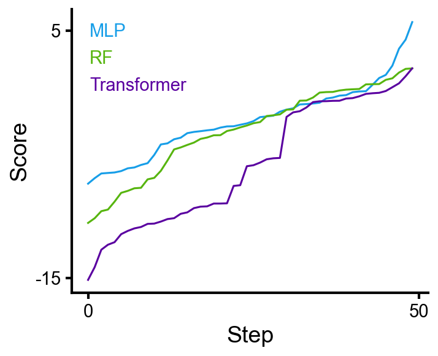

---

## Line plots

```python
f, ax = cp.fig()
ax.line(x, y1, err=std1, label='Model A', err_label='±1 SD')
ax.line(x, y2, err=std2, label='Model B')
ax.clean(xlabel='Step', ylabel='Score')
```

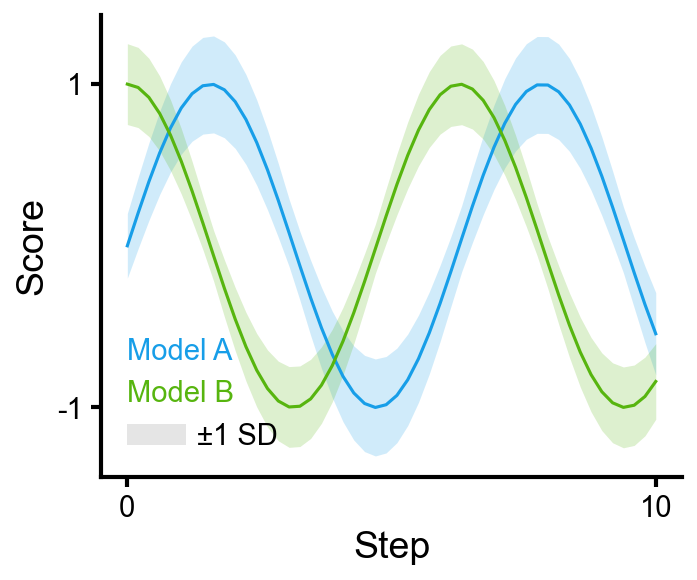

### Many runs in one color

A single `color=` and `alpha=` on a list of arrays overlays them in the same color. A single `label=` string produces one shared legend entry.

```python
f, ax = cp.fig()
ax.line(runs, color=cp.colors[0], alpha=0.3, label='Runs')
ax.line(np.mean(runs, axis=0), color=cp.colors[0], lw=2, label='Mean')
ax.clean(xlabel='Step', ylabel='Reward')
```

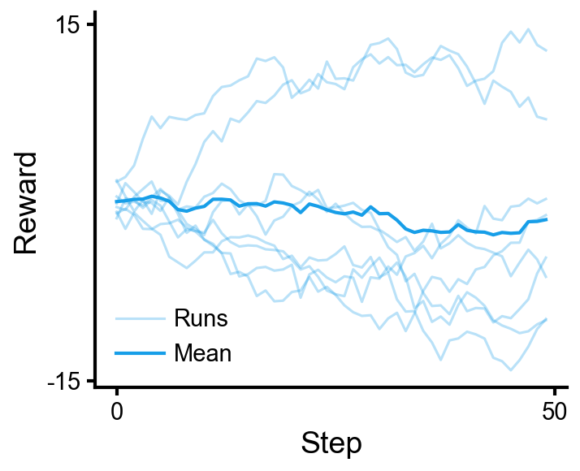

### Pivot DataFrame

Rows map to colors, columns to line styles. `err=` adds shaded bands.

A typical starting point is a flat run log:

```
>>> runs
     model  seed       train_loss              val_loss
0    MLP       0  [2.48, 2.33, ...]     [2.59, 2.42, ...]
1    MLP       1  [2.51, 2.30, ...]     [2.62, 2.40, ...]
2    MLP       2  [2.46, 2.34, ...]     [2.58, 2.43, ...]
3    Tx        0  [1.98, 1.87, ...]     [2.09, 1.96, ...]
4    Tx        1  ...                   ...
```

Aggregate across seeds:

```python
pivot     = (runs.drop(columns='seed').groupby('model')
                 .agg(lambda s: np.mean(np.stack(s.values), axis=0)))
pivot_std = (runs.drop(columns='seed').groupby('model')
                 .agg(lambda s: np.std (np.stack(s.values), axis=0)))
```

```python
f, ax = cp.fig()
ax.line(pivot, err=pivot_std, err_label='±1 SD')
ax.clean(xlabel='Epoch')
```

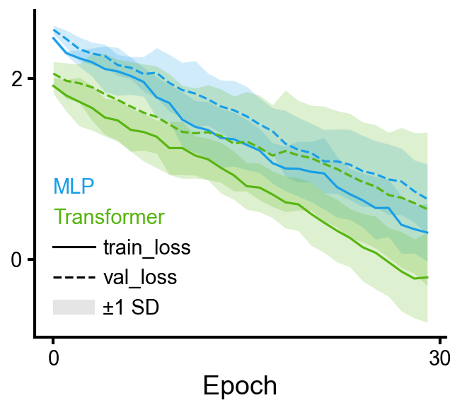

### Wide DataFrame with MultiIndex columns

DataFrames from `cp.data.collapse()` have MultiIndex columns. The top column level maps to line styles, remaining levels map to colors.

```python
mean = cp.data.collapse(df, index='epoch', values=['train_loss', 'val_loss'],
                         over='seed', func='mean')
std  = cp.data.collapse(df, index='epoch', values=['train_loss', 'val_loss'],
                         over='seed', func='std')

f, ax = cp.fig()
ax.line(mean, err=std, err_label='±1 SD')
ax.clean(ylabel='Loss')
```

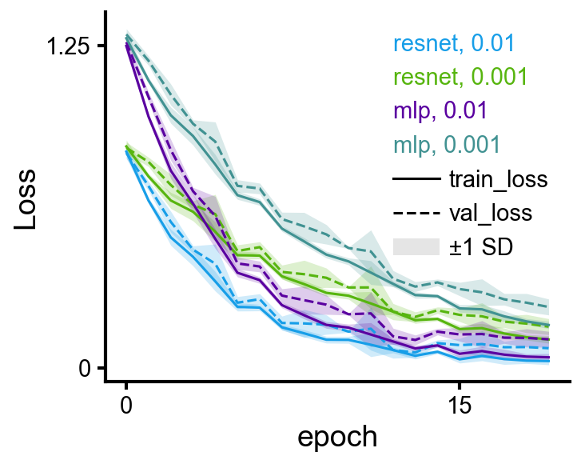

---

## Bar charts

```python
f, ax = cp.fig()
ax.bar(model_names, accuracies, err=stds, err_label='±1 SD')
ax.clean(ylabel='Accuracy')
```

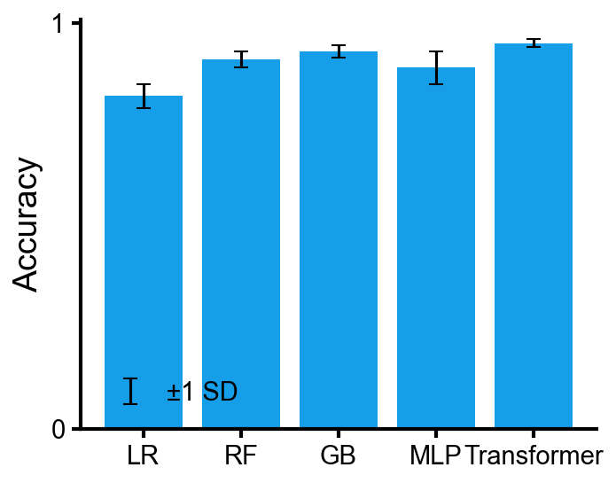

`barh` mirrors `bar` with horizontal orientation (same input forms, `err=`, DataFrame grouping, `log_x=`):

```python
f, ax = cp.fig()
ax.barh(model_names, accuracies, err=stds, err_label='±1 SD')
ax.clean(xlabel='Accuracy')
```

A DataFrame produces grouped bars (columns → groups, rows → categories):

```python
f, ax = cp.fig()
ax.bar(df, err=err_df, err_label='±1 SD')
ax.clean(ylabel='Score')
ax.get_legend().set_loc('upper left')
```

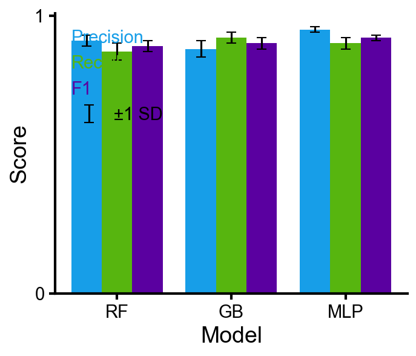

---

## Scatter

`yerr=` and `xerr=` add error bars. Use `err_label=`, `xerr_label=`, `yerr_label=` for legend entries.

```python
f, ax = cp.fig()
ax.scatter(x, y, xerr=xerrs, yerr=yerrs, label='Model A',
           xerr_label='time uncertainty', yerr_label='accuracy uncertainty')
ax.clean(xlabel='Training time (min)', ylabel='Accuracy')
```

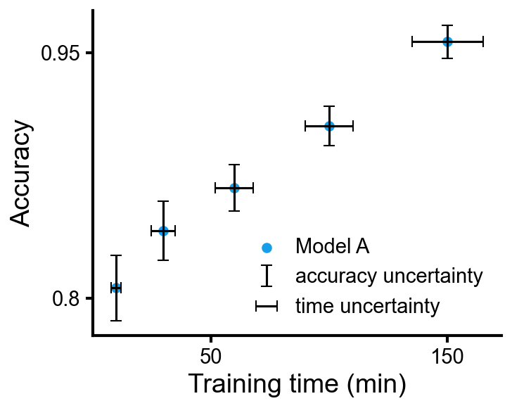

An Nx2 array or DataFrame splits into x, y (DataFrame column names become axis labels); Nx3 uses the third column as marker size.

```python
ax.scatter(df[['PC1', 'PC2']], s=15, alpha=0.6)
```

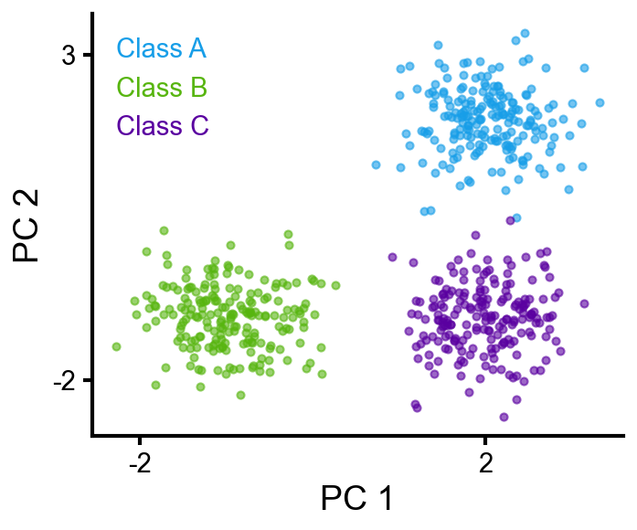

### Categorical grouping

`group=` assigns colors from the cycle and creates legend entries. Mutually exclusive with `c=`. Array-valued kwargs like `edgecolors` are automatically split per group.

```python
f, ax = cp.fig()
ax.scatter(df['x'], df['y'], group=df['class'],
           edgecolors=cp.cmaps.inferno(df['confidence']), linewidths=1.5)
cb = ax.add_colorbar(cp.cmaps.inferno, values=df['confidence'])
cb.set_label('confidence')
ax.clean(xlabel='x', ylabel='y')
```

### Colorbar for manual color mapping

`ax.add_colorbar(cmap, values)` creates a colorbar from a colormap and the data values that were mapped through it. Works on any axes, not just scatter.

```python
cb = ax.add_colorbar(cp.cmaps.inferno, values=data)   # range from data
cb = ax.add_colorbar(cp.cmaps.inferno, vmin=0, vmax=1) # explicit range
cb.set_label('confidence')
cb.set_ticks([0, 0.5, 1])
```

---

## Heatmap

Takes a 2-d array or DataFrame. Handles annotations, colorbar, and tick labels. DataFrame index/column names become axis labels automatically.

```python
f, ax = cp.fig()
cb = ax.heatmap(conf, fmt='d', cmap='Blues')
ax.clean(ticks=False, spines=None)
```

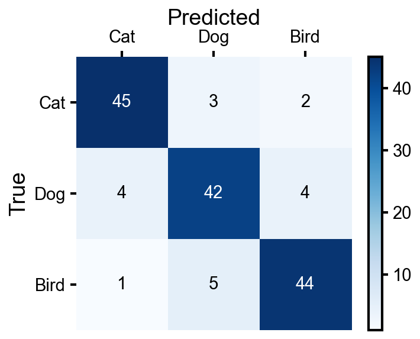

`heatmap` returns the matplotlib `Colorbar` object (or `None` if `cbar=False`), so you can set its label, ticks, etc. directly:

```python
cb = ax.heatmap(data, cmap='Blues')
cb.set_label('Count')
cb.set_ticks([0, 25, 50])
```

For custom annotation strings, pass `annot_strings=` with a same-shape array or DataFrame:

```python
means = cp.data.collapse(df, 'gamma', 'test_accuracy', over='fold', func='mean')
stds  = cp.data.collapse(df, 'gamma', 'test_accuracy', over='fold', func='std')
annot = means.round(2).astype(str) + '±' + stds.round(2).astype(str)

f, ax = cp.fig()
ax.heatmap(means, annot_strings=annot, cmap='Blues')
ax.clean(ticks=False, spines=None)
```

---

## Comparing distributions

`box`, `violin`, `strip`, and `hist` all take a dict of group name → array (or DataFrame / list of arrays). `box`, `violin`, and `strip` default to a single color; `hist` uses the color cycle.

```python
data = {'LR': scores_lr, 'RF': scores_rf, 'GB': scores_gb, 'MLP': scores_mlp}
ax.box(data)         # or ax.violin(data), or ax.strip(data)
```

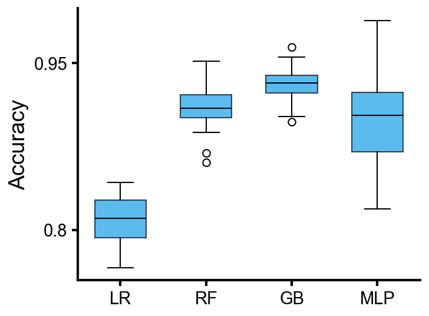 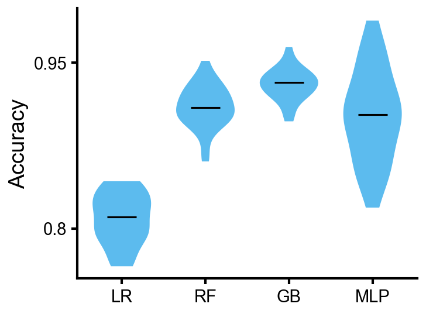

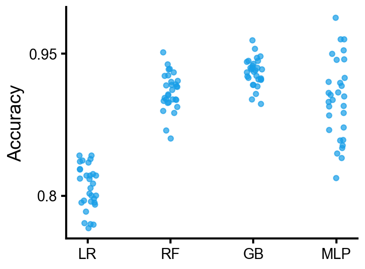

`hist` draws overlaid histograms with shared bins. Uses `histtype='stepfilled'` and `alpha=0.5` by default. Extra kwargs forward to matplotlib's `hist`.

```python
f, ax = cp.fig()
ax.hist([baseline, tuned, ablation],
        label=['Baseline', 'Tuned', 'Ablation'],
        bins=40, density=True)
ax.clean(xlabel='Prediction error', ylabel='Density')
```

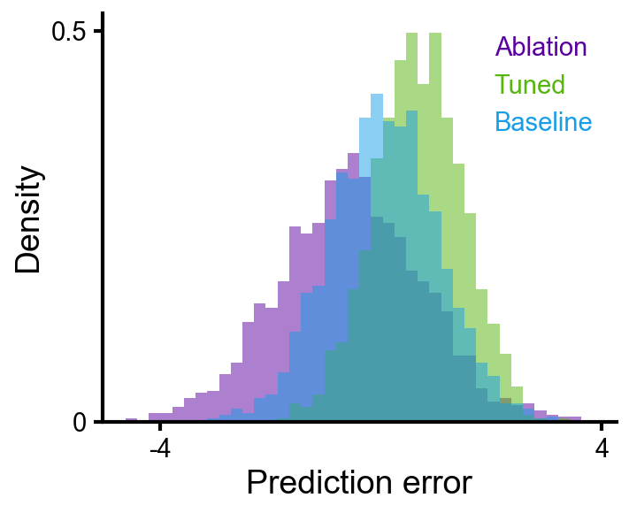

`log_x=True` gives log-spaced bins on a log x-axis. `bw_method=` on `violin` controls KDE smoothing (Scott's rule by default). `box`, `violin`, and `strip` accept a pivot DataFrame for grouped layouts (index → x-axis categories, columns → colored groups, matching `bar`).

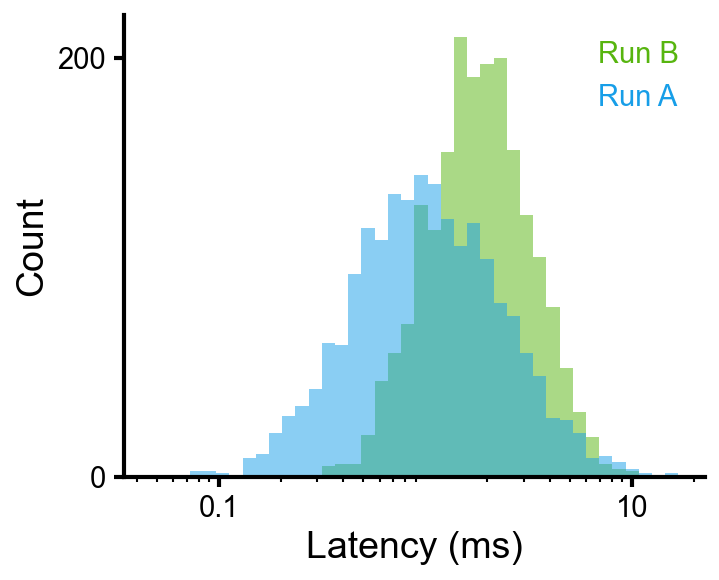

---

## Multi-panel layouts

```python
f, axes = cp.fig(rows=2, cols=2)
axes[0, 0].line(loss);                    axes[0, 0].clean(ylabel='Loss', xlabel='Epoch')
axes[0, 1].bar(['A', 'B', 'C'], vals);    axes[0, 1].clean(ylabel='Accuracy')
axes[1, 0].scatter(embeddings, s=20);     axes[1, 0].clean(xlabel='PC1', ylabel='PC2')
axes[1, 1].box({'M1': s1, 'M2': s2});     axes[1, 1].clean(ylabel='Score')
f.tight_layout()
```

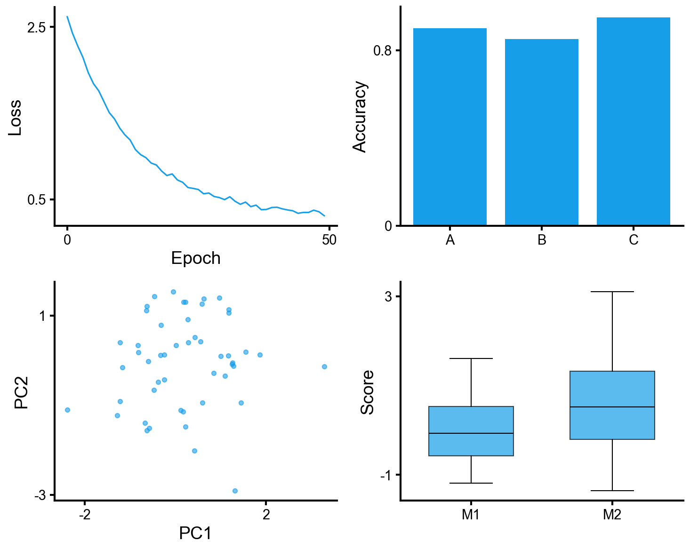

```python
f.subplots_adjust(hspace=0.55, wspace=0.45)   # when labels overlap
```

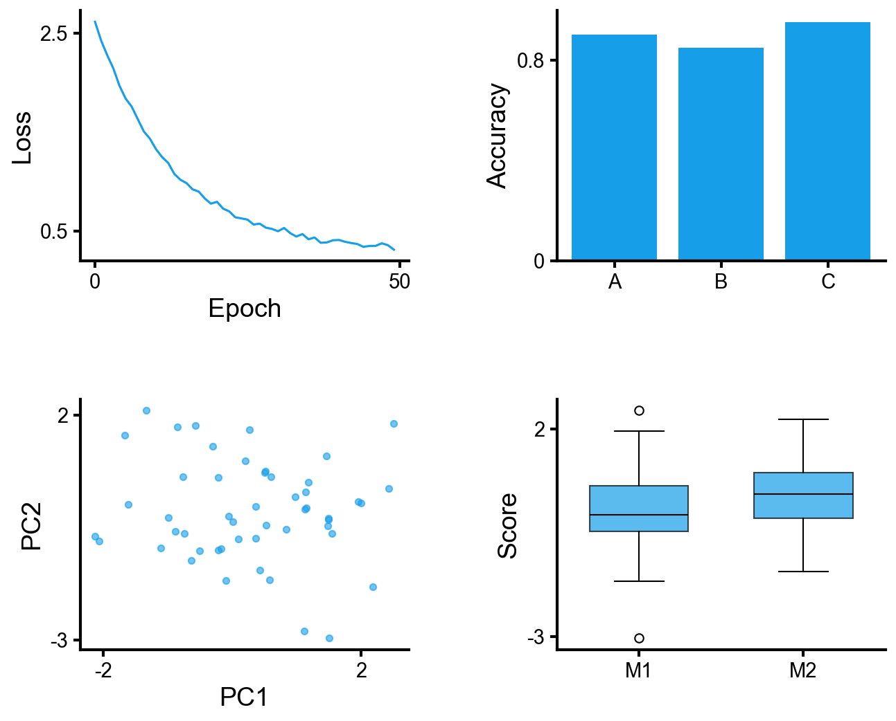

---

## Data wrangling (`cp.data`)

Helpers for the tidy → wide → aggregated pipeline common in ML experiments. Loud errors over silent wrong numbers (uses `pivot`, not `pivot_table`).

Starting from tidy data:

```
     model    lr  seed  epoch  train_loss  val_loss
0    resnet  0.01     0      0        0.82      0.91
1    resnet  0.01     0      1        0.54      0.63
...
```

```python
# Lossless pivot: every non-index, non-value column becomes a column level
wide = cp.data.to_wide(df, index='epoch', values=['train_loss', 'val_loss'])

# Aggregate over a column level (like xarray .mean(dim=...))
mean = cp.data.agg_over(wide, col_level='seed', func='mean')
std  = cp.data.agg_over(wide, col_level='seed', func='std')

# Or in one step:
mean = cp.data.collapse(df, index='epoch', values=['train_loss', 'val_loss'],
                         over='seed', func='mean')  # func is required

# Filter by column level (like xarray .sel())
cp.data.slice(mean, model='resnet')
cp.data.slice(mean, metric='train_loss', lr=0.01)
```

Note on `std`: `func='std'` uses pandas default (ddof=1, sample std). With few seeds, this differs from `np.std` (ddof=0).

---

## Colormaps

Access via `cp.cmaps.<name>`.

| Category | Default | Other options |
|---|---|---|
| Sequential |  `inferno` |  `plasma` &nbsp;  `viridis` &nbsp;  `magma` |
| Diverging |  `RdBu` |  `coolwarm` &nbsp;  `PiYG` |
| Binary |  `gray` | — |
| Categorical |  `categorical` | (built from `cp.colors`) |
| Cyclic |  `phase` (cmocean) | — |

---

## Hard-to-Google tricks

Matplotlib features that cleanplots doesn't wrap. Work on any `CleanAxes` (it's an `Axes` subclass).

### Rotate tick labels

```python
ax.tick_params(axis='x', rotation=45)
plt.setp(ax.get_xticklabels(), ha='right')
```

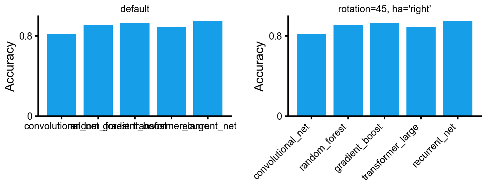

### Annotate a point

```python
ax.annotate('best',
            xy=(150, 0.93), xytext=(100, 0.80),
            fontsize=11,
            arrowprops=dict(arrowstyle='->', color='gray', lw=1))
```

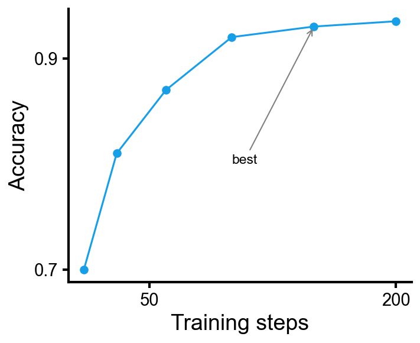

### Square axes

```python
ax.set_aspect('equal')
```

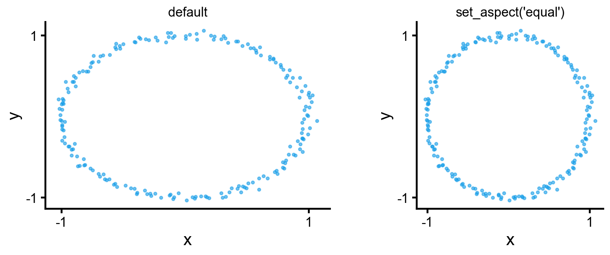
