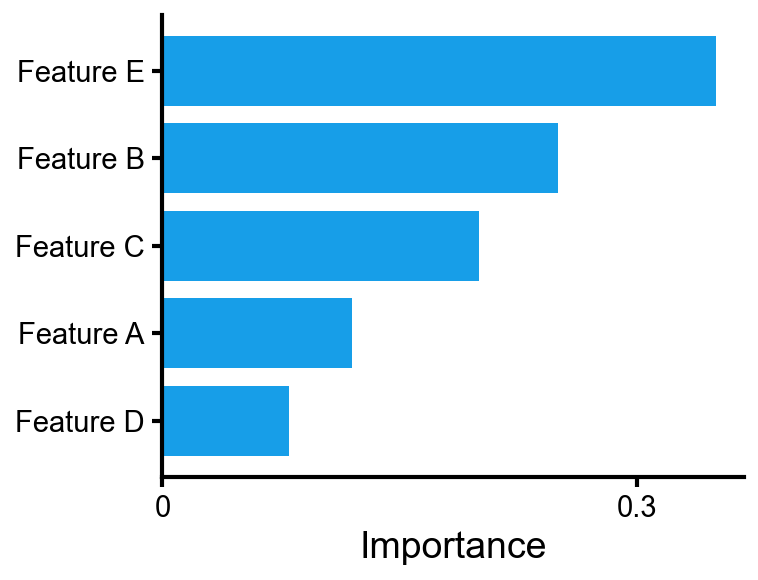
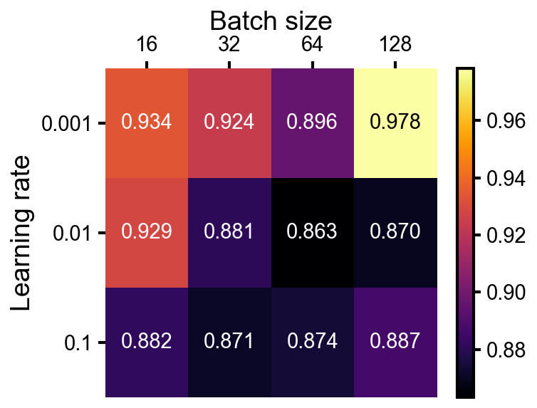
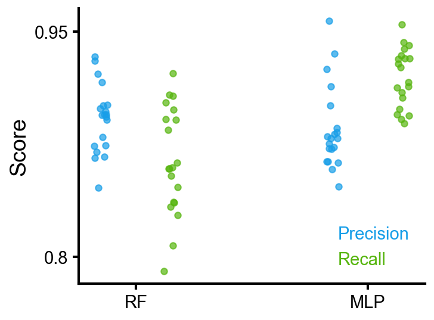
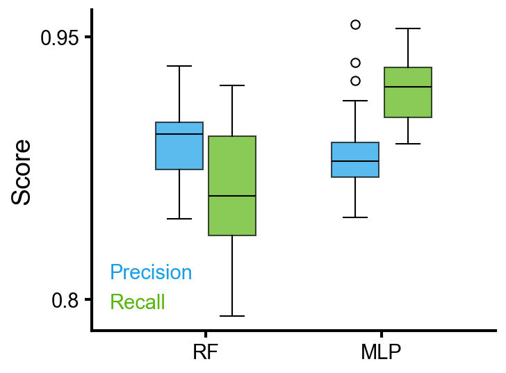
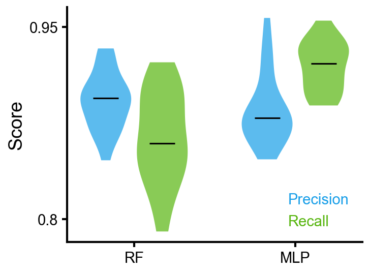

A reference for the cleanplots-specific API. Assumes matplotlib familiarity.

```python
import numpy as np
import pandas as pd
import cleanplots as cp
import matplotlib.pyplot as plt
```

---

## Setup and common patterns

Every plot starts with `cp.fig()` and ends with `ax.clean()`.

```python
f, ax = cp.fig()                          # single axes
f, axes = cp.fig(rows=2, cols=2)          # grid
f, (ax1, ax2) = cp.fig(cols=2)            # side-by-side
ax.clean(xlabel='X', ylabel='Y')          # standard cleanup
ax.clean(ticks=None, spines=None)         # no axes (for images)
```

**Error representation.** `err=` adds error visualization (shaded band for lines, error bars for bar/scatter). Accepts symmetric error, a `(lower, upper)` tuple, or an Nx2 array. `err_label=` creates a single shared legend entry.

**Legend.** `clean()` builds the legend automatically. Pass `legend=False` to any plot call to suppress it entirely. `ax.get_legend().set_loc('upper left')` repositions after `clean()`.

**Color labels.** `clean()` automatically replaces multi-color legend entries with colored text. To place manually:

```python
ax.color_labels(['MLP', 'RF', 'Transformer'], x=0.05, ha='left')
```


---

## Line plots

### Training curves with error bands

Starting from tidy per-epoch data:

```
     model        seed  epoch  train_loss  val_loss
0    MLP          0     0      2.41        2.55
1    MLP          0     1      2.18        2.33
...
60   Transformer  0     0      1.95        2.08
...
```

Collapse over seeds — the resulting DataFrame has MultiIndex columns. The top level (`metric`) maps to line styles, remaining levels map to colors:

```python
mean = cp.data.collapse(df, 'epoch', ['train_loss', 'val_loss'], over='seed', func='mean')
std  = cp.data.collapse(df, 'epoch', ['train_loss', 'val_loss'], over='seed', func='std')
```

```
metric      train_loss               val_loss
model       MLP    Transformer       MLP    Transformer
epoch
0           2.41   1.95              2.55   2.08
1           2.18   1.72              2.33   1.86
2           1.97   1.51              2.14   1.66
...
```

```python
f, ax = cp.fig()
ax.line(mean, err=std, err_label='±1 SD')
ax.clean(ylabel='Loss')
```


Use `cp.data.slice` to filter by any column level:

```python
ax.line(cp.data.slice(mean, model='MLP'), err=cp.data.slice(std, model='MLP'))
```

### Plotting individual runs

When `color=` and `label=` are both set on a DataFrame, you get one color legend entry plus shared linestyle entries:

```python
wide = cp.data.to_wide(df, 'epoch', ['train_loss', 'val_loss'])

for i, model in enumerate(['small', 'medium', 'large']):
    ax.line(cp.data.slice(wide, model=model), color=cp.colors[i], label=model, alpha=0.5)
```

For raw arrays (e.g. RL reward curves):

```python
ax.line(runs, color=cp.colors[0], alpha=0.3, label='Runs')
ax.line(np.mean(runs, axis=0), color=cp.colors[0], lw=2, label='Mean')
```


---

## Bar charts

### Grouped bar chart with error bars

Starting from tidy per-seed metrics:

```
     model           seed  precision  recall    f1
0    random_forest   0     0.92       0.88      0.90
1    random_forest   1     0.90       0.86      0.88
...
```

Collapse over seeds:

```python
mean = cp.data.collapse(df, 'model', ['precision', 'recall', 'f1'], over='seed', func='mean')
std  = cp.data.collapse(df, 'model', ['precision', 'recall', 'f1'], over='seed', func='std')
```

Result — index becomes x-axis categories, columns become colored groups:

```
metric          precision  recall    f1
model
gradient_boost  0.88       0.92      0.90
logistic        0.82       0.85      0.83
mlp             0.94       0.90      0.92
random_forest   0.91       0.87      0.89
```

```python
f, ax = cp.fig()
ax.bar(mean, err=std, err_label='±1 SD')
ax.clean(ylabel='Score')
```


### Horizontal bar chart

For a single metric, `collapse` returns a Series. Pass directly to `barh`:

```python
mean = cp.data.collapse(df, 'feature', 'importance', over='seed', func='mean')
std  = cp.data.collapse(df, 'feature', 'importance', over='seed', func='std')
```

```
mean importance
feature
feature_0    0.15
feature_1    0.08
feature_2    0.12
...
```

```python
f, ax = cp.fig()
ax.barh(mean, err=std)
ax.clean()
```



---

## Scatter

An Nx2 DataFrame splits into x, y with column names as axis labels:

```python
ax.scatter(df[['PC1', 'PC2']], s=15, alpha=0.6)
```


`yerr=` and `xerr=` add error bars:

```python
ax.scatter(x, y, xerr=xerrs, yerr=yerrs, label='Model A',
           xerr_label='time uncertainty', yerr_label='accuracy uncertainty')
```


### Categorical grouping

`group=` assigns colors from the cycle and creates legend entries:

```python
ax.scatter(df['x'], df['y'], group=df['class'],
           edgecolors=cp.cmaps.inferno(df['confidence']), linewidths=1.5)
cb = ax.add_colorbar(cp.cmaps.inferno, values=df['confidence'])
cb.set_label('confidence')
```

### Colorbar

`ax.add_colorbar(cmap, values)` creates a colorbar from a colormap and the data values that were mapped through it. Works on any axes.

```python
cb = ax.add_colorbar(cp.cmaps.inferno, values=data)   # range from data
cb = ax.add_colorbar(cp.cmaps.inferno, vmin=0, vmax=1) # explicit range
cb.set_label('confidence')
cb.set_ticks([0, 0.5, 1])
```

---

## Heatmap

### Hyperparameter grid search

Starting from tidy cross-validation results:

```
     C      gamma  fold  test_accuracy
0    0.01   0.001  0     0.71
1    0.01   0.001  1     0.73
...
```

Collapse over folds — index and columns become axis labels automatically:

```python
mean = cp.data.collapse(df, 'gamma', 'test_accuracy', over='fold', func='mean')
std  = cp.data.collapse(df, 'gamma', 'test_accuracy', over='fold', func='std')
```

```
mean test_accuracy
C            0.01   0.1    1.0    10.0   100.0
gamma
0.001        0.72   0.74   0.78   0.82   0.79
0.01         0.73   0.76   0.83   0.90   0.85
0.1          0.71   0.73   0.77   0.81   0.78
1.0          0.70   0.71   0.72   0.73   0.72
```

Custom annotation strings:

```python
annot = mean.round(2).astype(str) + '±' + std.round(2).astype(str)

f, ax = cp.fig()
ax.heatmap(mean, annot_strings=annot, cmap='Blues')
ax.clean(ticks=False, spines=None)
```



`heatmap` returns the `Colorbar` object so you can set label/ticks directly:

```python
cb = ax.heatmap(data, cmap='Blues')
cb.set_label('Count')
cb.set_ticks([0, 25, 50])
```

### Confusion matrix

```python
f, ax = cp.fig()
ax.heatmap(conf_matrix, fmt='d', cmap='Blues')
ax.clean(ticks=False, spines=None, ylabel='True', xlabel='Predicted')
```


---

## Comparing distributions

### Grouped layout from a DataFrame

To show raw data points per group (as an alternative to a grouped bar chart), use `collapse` with `func=list` to collect values into arrays:

```python
df = cp.data.collapse(data, 'model', ['precision', 'recall', 'f1'], over='seed', func=list)
```

Result — index becomes x-axis categories, columns become colored groups (same convention as `bar`):

```
metric          precision               recall                  f1
model
gradient_boost  [0.88, 0.87, 0.89, ...]  [0.92, 0.91, 0.93, ...]  [0.90, 0.89, ...]
logistic        [0.82, 0.81, 0.83, ...]  [0.85, 0.84, 0.86, ...]  [0.83, 0.82, ...]
mlp             [0.94, 0.93, 0.95, ...]  [0.90, 0.89, 0.91, ...]  [0.92, 0.91, ...]
random_forest   [0.91, 0.90, 0.92, ...]  [0.87, 0.86, 0.88, ...]  [0.89, 0.88, ...]
```

```python
ax.strip(df)     # or ax.box(df), or ax.violin(df)
```



 

### Simple distribution comparison

A dict of group name → array shows one group per x position in a single color:

```python
data = {'LR': scores_lr, 'RF': scores_rf, 'GB': scores_gb, 'MLP': scores_mlp}
ax.box(data)         # or ax.violin(data), or ax.strip(data)
```

 


### Histograms

Overlaid histograms with shared bins. `histtype='stepfilled'` and `alpha=0.5` by default.

```python
ax.hist([baseline, tuned, ablation],
        label=['Baseline', 'Tuned', 'Ablation'],
        bins=40, density=True)
ax.clean(xlabel='Prediction error', ylabel='Density')
```


`log_x=True` gives log-spaced bins on a log x-axis.


---

## Multi-panel layouts

```python
f, axes = cp.fig(rows=2, cols=2)
axes[0, 0].line(loss);                    axes[0, 0].clean(ylabel='Loss', xlabel='Epoch')
axes[0, 1].bar(['A', 'B', 'C'], vals);    axes[0, 1].clean(ylabel='Accuracy')
axes[1, 0].scatter(embeddings, s=20);     axes[1, 0].clean(xlabel='PC1', ylabel='PC2')
axes[1, 1].box({'M1': s1, 'M2': s2});     axes[1, 1].clean(ylabel='Score')
f.tight_layout()
```


```python
f.subplots_adjust(hspace=0.55, wspace=0.45)   # when labels overlap
```


---

## Data wrangling (`cp.data`)

Helpers for the tidy → wide → aggregated pipeline. Loud errors over silent wrong numbers (uses `pivot`, not `pivot_table`).

```python
# One-step: pivot + aggregate
mean = cp.data.collapse(df, index='epoch', values=['train_loss', 'val_loss'],
                         over='seed', func='mean')

# Two-step equivalent:
wide = cp.data.to_wide(df, index='epoch', values=['train_loss', 'val_loss'])
mean = cp.data.agg_over(wide, col_level='seed', func='mean')

# Filter by column level
cp.data.slice(mean, model='resnet')
cp.data.slice(mean, metric='train_loss', lr=0.01)
```

---

## Colormaps

Access via `cp.cmaps.<name>`.

| Category | Default | Other options |
|---|---|---|
| Sequential |  `inferno` |  `plasma` &nbsp;  `viridis` &nbsp;  `magma` |
| Diverging |  `RdBu` |  `coolwarm` &nbsp;  `PiYG` |
| Binary |  `gray` | — |
| Categorical |  `categorical` | (built from `cp.colors`) |
| Cyclic |  `phase` (cmocean) | — |

---

## Hard-to-Google tricks

Matplotlib features that cleanplots doesn't wrap. Work on any `CleanAxes` (it's an `Axes` subclass).

### Rotate tick labels

```python
ax.tick_params(axis='x', rotation=45)
plt.setp(ax.get_xticklabels(), ha='right')
```


### Annotate a point

```python
ax.annotate('best',
            xy=(150, 0.93), xytext=(100, 0.80),
            fontsize=11,
            arrowprops=dict(arrowstyle='->', color='gray', lw=1))
```


### Square axes

```python
ax.set_aspect('equal')
```


