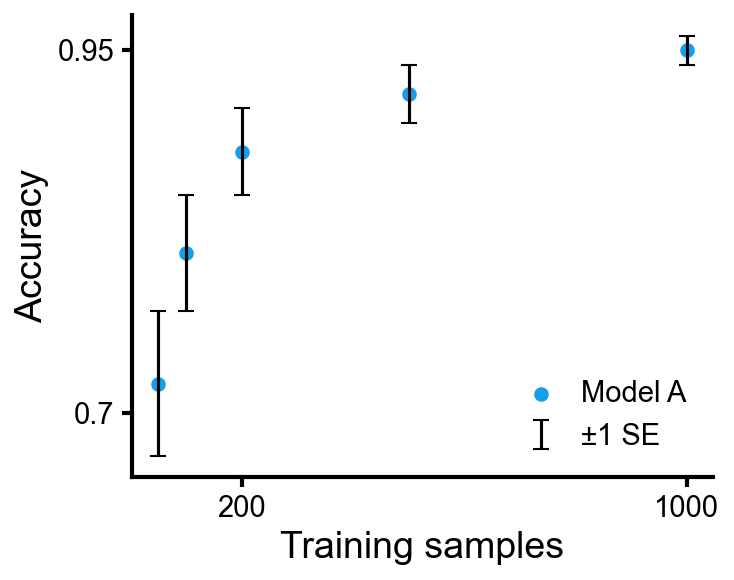

A reference for the cleanplots-specific API. Assumes matplotlib familiarity.

```python
import numpy as np
import pandas as pd
import cleanplots as cp
import matplotlib.pyplot as plt
```

Every plot starts with `cp.fig()` and ends with `ax.clean()`. `cp.fig()` returns a `(Figure, CleanAxes)` pair; `clean()` strips top/right spines, sparsifies ticks, applies labels, and removes legend frames.

```python
f, ax = cp.fig()                          # single axes
f, axes = cp.fig(rows=2, cols=2)          # grid
f, (ax1, ax2) = cp.fig(cols=2)            # side-by-side
ax.clean(xlabel='X', ylabel='Y')          # standard cleanup
ax.clean(ticks=None, spines=None)         # no axes (for images)
```

---

## Line plots

The basic call mirrors `ax.plot`. `err=` adds a shaded band; `err_label=` puts a single legend entry for the band.

```python
f, ax = cp.fig()
ax.line(x, y1, err=std1, label='Model A', err_label='±1 SD')
ax.line(x, y2, err=std2, label='Model B')
ax.clean(xlabel='Step', ylabel='Score')
```


**Accepted input forms.** All of these work:

```python
ax.line(y_values)                                # x inferred as range
ax.line(x_values, y_values)                      # standard
ax.line([y1, y2, y3], label=['A', 'B', 'C'])     # list of arrays → multiple lines
```

### Many runs in one color

Pass a list of arrays plus a single `color=` and `alpha=` to overlay multiple runs of the same experiment. A single `label=` string in this mode produces one shared legend entry instead of N duplicates.

```python
f, ax = cp.fig()
ax.line(runs, color=cp.colors[0], alpha=0.3, label='Runs')
ax.line(np.mean(runs, axis=0), color=cp.colors[0], lw=2, label='Mean')
ax.clean(xlabel='Step', ylabel='Reward')
```


### Pivot DataFrame

Rows of the pivot map to colors, columns to line styles. A separate `err=` DataFrame adds shaded bands. If the pivot has only one column, its name becomes the y-label instead of a legend entry.

A typical starting point is a flat run log with one row per (model, seed) and array-valued metric columns:

```
>>> runs
     model  seed       train_loss              val_loss
0    MLP       0  [2.48, 2.33, ...]     [2.59, 2.42, ...]
1    MLP       1  [2.51, 2.30, ...]     [2.62, 2.40, ...]
2    MLP       2  [2.46, 2.34, ...]     [2.58, 2.43, ...]
3    Tx        0  [1.98, 1.87, ...]     [2.09, 1.96, ...]
4    Tx        1  ...                   ...
```

Aggregate across seeds to produce the pivot the function expects:

```python
pivot     = (runs.drop(columns='seed').groupby('model')
                 .agg(lambda s: np.mean(np.stack(s.values), axis=0)))
pivot_std = (runs.drop(columns='seed').groupby('model')
                 .agg(lambda s: np.std (np.stack(s.values), axis=0)))
```

```
>>> pivot
                     train_loss              val_loss
MLP           [2.48, 2.33, ...]       [2.59, 2.42, ...]
Transformer   [1.98, 1.87, ...]       [2.09, 1.96, ...]
```

```python
f, ax = cp.fig()
ax.line(pivot, err=pivot_std, err_label='±1 SD')
ax.clean(xlabel='Epoch')
```


The matplotlib equivalent of the plot itself requires a nested loop, manual color/linestyle assignment, and a hand-built two-axis legend. About 15 lines.

---

## Bar charts

```python
f, ax = cp.fig()
ax.bar(model_names, accuracies, err=stds, err_label='±1 SD')
ax.clean(ylabel='Accuracy')
```


`bar` accepts the same input variants as `line` (single-arg, two-arg, DataFrame). For horizontal bars use `ax.barh`.

### Grouped bar from DataFrame

Each column becomes a group, each row becomes a category.

```
>>> df
       Precision  Recall    F1
RF          0.91    0.87  0.89
GB          0.88    0.92  0.90
MLP         0.95    0.90  0.92
```

```python
f, ax = cp.fig()
ax.bar(df, err=err_df, err_label='±1 SD')
ax.clean(ylabel='Score')
ax.get_legend().set_loc('upper left')      # move the legend after clean()
```


The matplotlib equivalent is ~10 lines of manual offset arithmetic.

The `get_legend().set_loc(...)` line is the generic way to reposition the legend (or color-label block) after `clean()` without rebuilding it. Standard matplotlib loc strings work: `'upper left'`, `'lower right'`, `'center'`, etc.

---

## Scatter

```python
f, ax = cp.fig()
ax.scatter(x, y, yerr=errs, label='Model A', err_label='±1 SE')
ax.clean(xlabel='Training samples', ylabel='Accuracy')
```



For both axes, use `xerr_label` and `yerr_label` separately. The legend draws a horizontal marker for x and a vertical marker for y.

```python
f, ax = cp.fig()
ax.scatter(x, y, xerr=xerrs, yerr=yerrs, label='Model A',
           xerr_label='time uncertainty', yerr_label='accuracy uncertainty')
ax.clean(xlabel='Training time (min)', ylabel='Accuracy')
```


**Matrix input.** An Nx2 array splits into x,y; an Nx3 array uses the third column as marker size.

```python
ax.scatter(embeddings_nx2, label='Class A', s=15, alpha=0.6)
ax.scatter(np.column_stack([x, y, sizes]), alpha=0.6)
```


---

## Heatmap

`ax.heatmap` takes a 2-d array or DataFrame and handles annotations, colorbar, and tick labels in one call.

```
>>> conf
      Cat  Dog  Bird
Cat    45    3     2
Dog     4   42     4
Bird    1    5    44
```

```python
f, ax = cp.fig()
ax.heatmap(conf, fmt='d', cmap='Blues')         # or fmt='.2f', cmap=cp.cmaps.diverging
ax.clean(ticks=False, spines=None, ylabel='True', xlabel='Predicted')
```


DataFrame index becomes y labels, columns become x labels (placed at the top). Annotation text color flips automatically for contrast. The matplotlib equivalent is ~15 lines.

---

## Comparing distributions

`box`, `violin`, `strip`, and `hist` all take the same input — a dict of group name → array (or a DataFrame / list of arrays). The first three color all groups the same by default (pass `color=[...]` to override); `hist` uses the color cycle since overlaid histograms are normally compared across colors.

```python
data = {'LR': scores_lr, 'RF': scores_rf, 'GB': scores_gb, 'MLP': scores_mlp}

f, ax = cp.fig()
ax.box(data)         # or ax.violin(data), or ax.strip(data)
ax.clean(ylabel='Accuracy')
```

 

`ax.strip` shows the raw points with a small jitter — useful when sample sizes are small enough that you'd rather show every observation than a summary.


`ax.hist` draws overlaid histograms with shared bins computed from the pooled data, so bars are directly comparable across groups. Uses `histtype='stepfilled'` and `alpha=0.5` by default. Pass a list of arrays with parallel `label=` (and optionally `color=`) lists; any extra kwargs forward to matplotlib's `hist` (e.g. `density=True`).

```python
f, ax = cp.fig()
ax.hist([baseline, tuned, ablation],
        label=['Baseline', 'Tuned', 'Ablation'],
        bins=40, density=True)
ax.clean(xlabel='Prediction error', ylabel='Density')
```


Pass `log_x=True` for log-spaced bins on a log x-axis (useful when the data spans orders of magnitude).

```python
f, ax = cp.fig()
ax.hist([run_a, run_b], label=['Run A', 'Run B'], bins=40, log_x=True)
ax.clean(xlabel='Latency (ms)', ylabel='Count')
```


Violins use a Gaussian KDE for smoothing; bandwidth follows Scott's rule by default. Pass `bw_method=` (a float, `'scott'`, or `'silverman'`) to override — larger values give smoother curves.

`box` and `violin` also accept a pivot DataFrame for grouped layouts (rows → colors, columns → groups), which is hard to do by hand in matplotlib.

---

## Color labels

`clean()` automatically replaces multi-color legend entries with colored text inside the legend — no extra call needed. If you want to place a stacked colored-text block manually at a specific spot in axes coordinates, use `ax.color_labels()`:

```python
f, ax = cp.fig()
for i, name in enumerate(['MLP', 'RF', 'Transformer']):
    ax.line(data[i], color=cp.colors[i])
ax.color_labels(['MLP', 'RF', 'Transformer'], x=0.05, ha='left')
ax.clean(xlabel='Step', ylabel='Score')
```


---

## Multi-panel layouts

```python
f, axes = cp.fig(rows=2, cols=2)
axes[0, 0].line(loss);                    axes[0, 0].clean(ylabel='Loss', xlabel='Epoch')
axes[0, 1].bar(['A', 'B', 'C'], vals);    axes[0, 1].clean(ylabel='Accuracy')
axes[1, 0].scatter(embeddings, s=20);     axes[1, 0].clean(xlabel='PC1', ylabel='PC2')
axes[1, 1].box({'M1': s1, 'M2': s2});     axes[1, 1].clean(ylabel='Score')
f.tight_layout()
```


When labels overlap, widen the spacing directly with `subplots_adjust`:

```python
f.subplots_adjust(hspace=0.55, wspace=0.45)
```


---

## Colormaps

Access via `cp.cmaps.<name>`. Each category has a sensible default.

| Category | Default | Other options |
|---|---|---|
| Sequential |  `inferno` |  `plasma` &nbsp;  `viridis` &nbsp;  `magma` |
| Diverging |  `RdBu` |  `coolwarm` &nbsp;  `PiYG` |
| Binary |  `gray` | — |
| Categorical |  `categorical` | (built from `cp.colors`) |
| Cyclic |  `phase` (cmocean) | — |

---

## Hard-to-Google tricks

These are matplotlib features that cleanplots doesn't wrap but that come up often enough to be worth keeping alongside the cp API. They work on any `CleanAxes` since it's a matplotlib `Axes` subclass.

### Rotate tick labels (and align them to the tick)

`tick_params(rotation=...)` rotates labels; `plt.setp(..., ha='right')` pulls their right edge back under each tick so they don't drift off.

```python
ax.tick_params(axis='x', rotation=45)
plt.setp(ax.get_xticklabels(), ha='right')
```


### Annotate a point

`annotate` with `xy=` (the point) and `xytext=` (where the text goes), optionally with an arrow.

```python
ax.annotate('best',
            xy=(150, 0.93), xytext=(100, 0.80),
            fontsize=11,
            arrowprops=dict(arrowstyle='->', color='gray', lw=1))
```


### Square axes (equal aspect ratio)

Important for scatters whose x and y live in the same coordinate space (embeddings, geographic coords, circular data).

```python
ax.set_aspect('equal')
```


