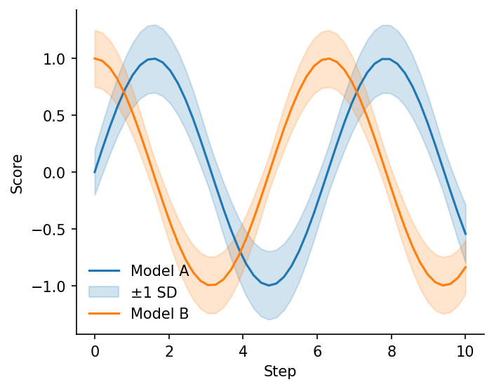
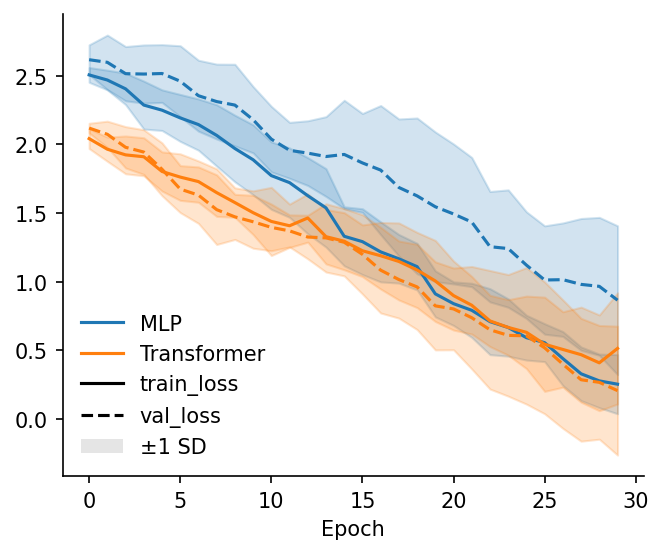
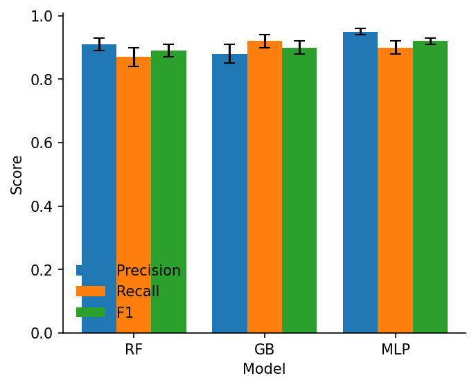
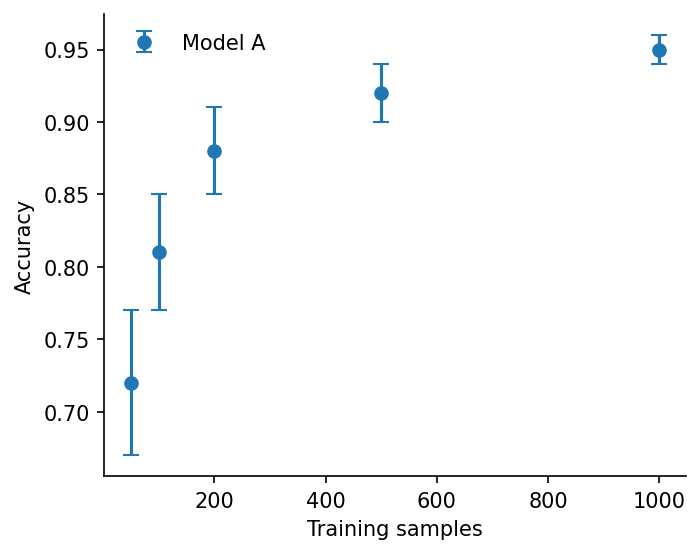
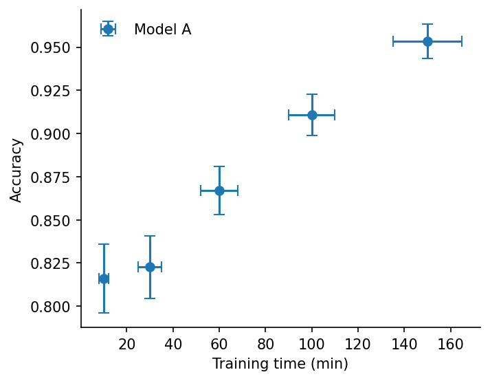
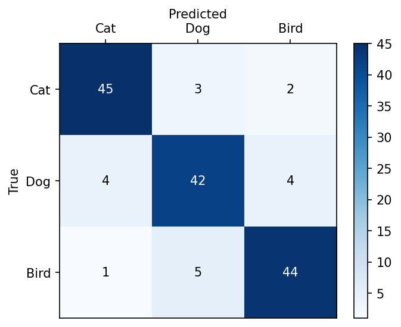
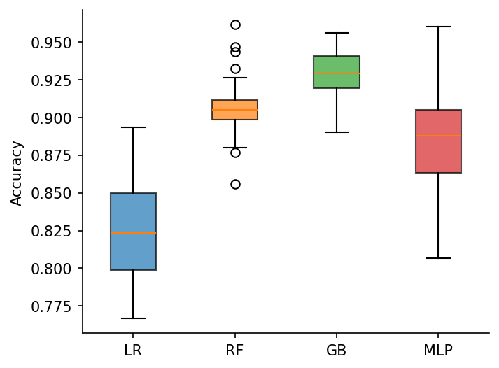
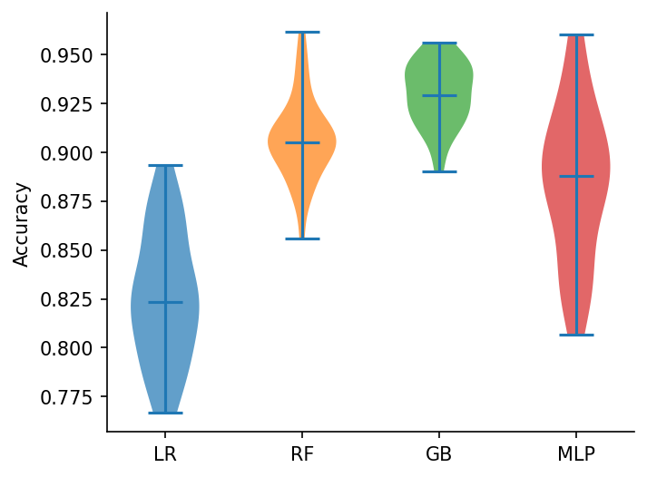
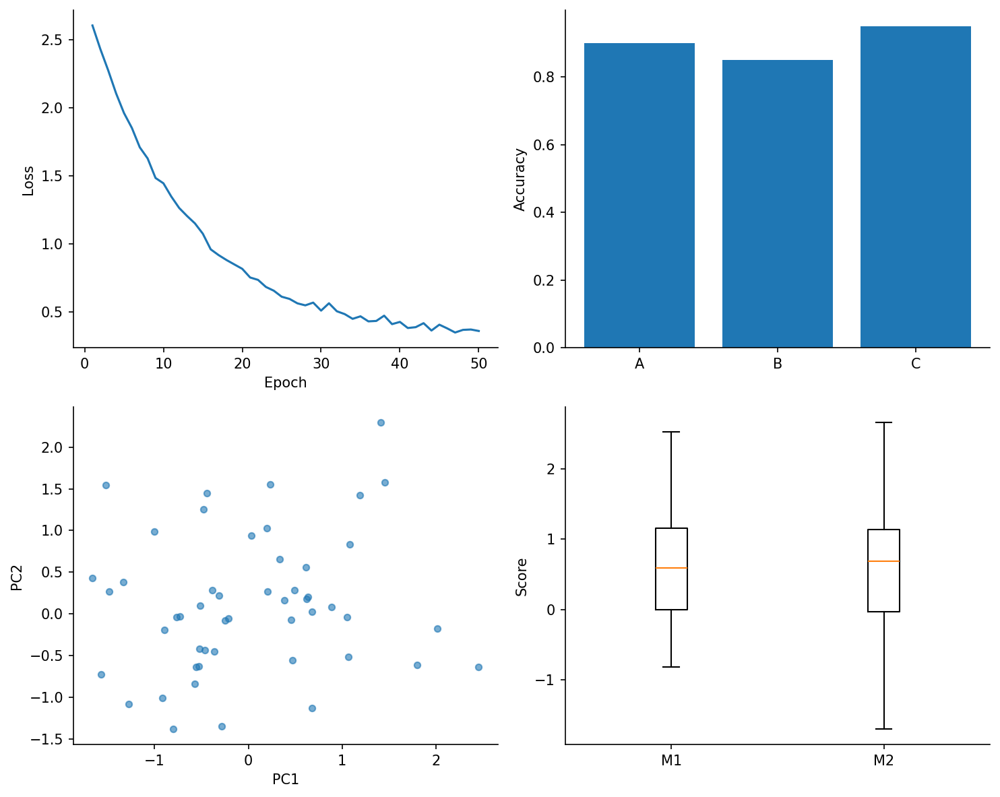

A fallback reference showing how to produce each plot in the cleanplots gallery using only matplotlib (plus numpy and pandas for data). The results approximate the cleanplots versions; exact styling details (sparse ticks, automatic colored legend labels, etc.) are omitted.

```python
import numpy as np
import pandas as pd
import matplotlib.pyplot as plt
```

A small helper mirrors the cleanplots default of hiding the top and right spines.

```python
def clean_spines(ax):
    ax.spines['top'].set_visible(False)
    ax.spines['right'].set_visible(False)
```

---

## Line plot with error band

`cp.line(..., err=...)` unpacks to `plot` + `fill_between`.

```python
f, ax = plt.subplots(figsize=(5, 4))
line1, = ax.plot(x, y1, label='Model A')
ax.fill_between(x, y1 - e1, y1 + e1, alpha=0.2,
                color=line1.get_color(), label='±1 SD')
line2, = ax.plot(x, y2, label='Model B')
ax.fill_between(x, y2 - e2, y2 + e2, alpha=0.2,
                color=line2.get_color())
ax.set_xlabel('Step'); ax.set_ylabel('Score')
ax.legend(frameon=False)
clean_spines(ax)
```



---

## Pivot DataFrame line plot

The pivot case (rows → colors, columns → line styles, with shared error bands) needs a nested loop and a hand-built two-axis legend. This is the most verbose matplotlib equivalent in the gallery.

```python
f, ax = plt.subplots(figsize=(5, 4))
row_colors = plt.rcParams['axes.prop_cycle'].by_key()['color']
line_styles = ['-', '--', ':', '-.']
epochs_x = np.arange(num_epochs)

for i, model in enumerate(pivot.index):
    color = row_colors[i % len(row_colors)]
    for j, metric in enumerate(pivot.columns):
        ls = line_styles[j % len(line_styles)]
        y = np.asarray(pivot.loc[model, metric])
        e = np.asarray(pivot_std.loc[model, metric])
        ax.plot(epochs_x, y, color=color, linestyle=ls)
        ax.fill_between(epochs_x, y - e, y + e, color=color, alpha=0.2)

# Hand-built two-axis legend: one entry per model (color) and per metric (linestyle)
model_handles = [plt.Line2D([0], [0], color=row_colors[i], linestyle='-', label=m)
                 for i, m in enumerate(pivot.index)]
metric_handles = [plt.Line2D([0], [0], color='black', linestyle=line_styles[j], label=m)
                  for j, m in enumerate(pivot.columns)]
band_handle = plt.Rectangle((0, 0), 1, 1, facecolor='gray', alpha=0.2, label='±1 SD')
ax.legend(handles=model_handles + metric_handles + [band_handle], frameon=False)
ax.set_xlabel('Epoch')
clean_spines(ax)
```



---

## Grouped bar chart

Manual offset arithmetic per column.

```python
f, ax = plt.subplots(figsize=(5, 4))
n_groups = len(bar_df.columns)
x_pos = np.arange(len(bar_df.index))
width = 0.8 / n_groups
for i, col in enumerate(bar_df.columns):
    offset = (i - (n_groups - 1) / 2) * width
    ax.bar(x_pos + offset, bar_df[col].values, width=width,
           yerr=bar_err[col].values, capsize=4,
           error_kw=dict(linewidth=1.5), label=col)
ax.set_xticks(x_pos)
ax.set_xticklabels(bar_df.index)
ax.set_xlabel('Model'); ax.set_ylabel('Score')
ax.legend(frameon=False)
clean_spines(ax)
```



---

## Scatter with y error bars

Use `errorbar` with `fmt='o'` rather than `scatter` + manual errorbars.

```python
f, ax = plt.subplots(figsize=(5, 4))
ax.errorbar(x, y, yerr=y_errs, fmt='o', capsize=4, label='Model A')
ax.set_xlabel('Training samples'); ax.set_ylabel('Accuracy')
ax.legend(frameon=False)
clean_spines(ax)
```



---

## Scatter with both x and y error bars

Same call, pass both `xerr=` and `yerr=`.

```python
f, ax = plt.subplots(figsize=(5, 4))
ax.errorbar(x, y, xerr=xerrs, yerr=yerrs, fmt='o', capsize=4, label='Model A')
ax.set_xlabel('Training time (min)'); ax.set_ylabel('Accuracy')
ax.legend(frameon=False)
clean_spines(ax)
```



---

## Heatmap (confusion matrix)

`imshow` + manual cell annotation with contrast-aware text color + manual tick labels.

```python
f, ax = plt.subplots(figsize=(5, 4))
values = conf_matrix.values
im = ax.imshow(values, cmap='Blues', aspect='auto')
ax.set_xticks(range(len(conf_matrix.columns)))
ax.set_xticklabels(conf_matrix.columns)
ax.set_yticks(range(len(conf_matrix.index)))
ax.set_yticklabels(conf_matrix.index)
ax.xaxis.set_label_position('top')
ax.tick_params(top=True, bottom=False, labeltop=True, labelbottom=False)

threshold = (values.min() + values.max()) / 2
for i in range(values.shape[0]):
    for j in range(values.shape[1]):
        color = 'white' if values[i, j] > threshold else 'black'
        ax.text(j, i, f'{values[i, j]:d}', ha='center', va='center', color=color)

f.colorbar(im, ax=ax)
ax.set_xlabel('Predicted'); ax.set_ylabel('True')
```



---

## Box plot

```python
f, ax = plt.subplots(figsize=(5, 4))
cycle = plt.rcParams['axes.prop_cycle'].by_key()['color']
bp = ax.boxplot(list(data.values()), tick_labels=list(data.keys()),
                patch_artist=True)
for i, patch in enumerate(bp['boxes']):
    patch.set_facecolor(cycle[i % len(cycle)])
    patch.set_alpha(0.7)
ax.set_ylabel('Accuracy')
clean_spines(ax)
```



## Violin plot

`violinplot` returns a dict whose `'bodies'` entry is the list of PolyCollections to color individually. Tick labels have to be set separately since `violinplot` doesn't accept a `tick_labels=` kwarg.

```python
f, ax = plt.subplots(figsize=(5, 4))
vp = ax.violinplot(list(data.values()), showmeans=False, showmedians=True)
for i, body in enumerate(vp['bodies']):
    body.set_facecolor(cycle[i % len(cycle)])
    body.set_alpha(0.7)
ax.set_xticks(range(1, len(data) + 1))
ax.set_xticklabels(list(data.keys()))
ax.set_ylabel('Accuracy')
clean_spines(ax)
```



---

## Multi-panel layout

```python
f, axes = plt.subplots(2, 2, figsize=(10, 8))
axes[0, 0].plot(epochs, train_loss)
axes[0, 0].set(xlabel='Epoch', ylabel='Loss')

axes[0, 1].bar(['A', 'B', 'C'], [0.9, 0.85, 0.95])
axes[0, 1].set_ylabel('Accuracy')

pts = np.random.randn(50, 2)
axes[1, 0].scatter(pts[:, 0], pts[:, 1], s=20, alpha=0.6)
axes[1, 0].set(xlabel='PC1', ylabel='PC2')

axes[1, 1].boxplot([s1, s2], tick_labels=['M1', 'M2'])
axes[1, 1].set_ylabel('Score')

for a in axes.flat:
    clean_spines(a)
f.tight_layout()
```


